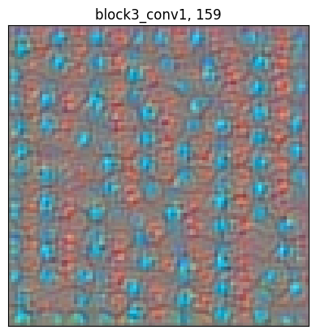
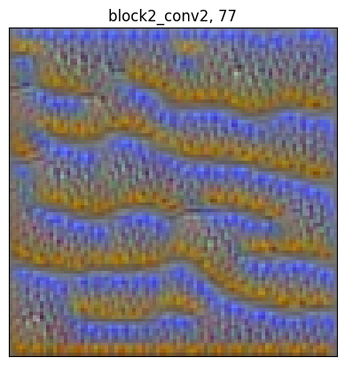
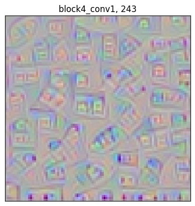
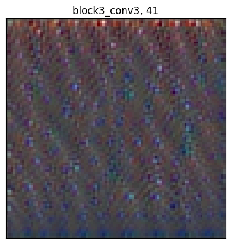

# Visualizing Filters of a CNN

This repository contains a Python notebook that demonstrates how to visualize the filters of a Convolutional Neural Network (CNN). The notebook provides an overview of the concept of filters in CNNs and explains how to visualize them using the VGG16 model and TensorFlow.

 |  
:-------------------------:|:-------------------------:
 |  

## Table of Contents
- [Introduction](#introduction)
- [Convolutional Neural Networks](#convolutional-neural-networks)
- [Visualizing Filters](#visualizing-filters)
- [Model Architecture: VGG16](#model-architecture-vgg16)
- [Implementation](#implementation)
- [Getting Started](#getting-started)
- [Conclusion](#conclusion)

## Introduction
Convolutional Neural Networks (CNNs) have revolutionized the field of computer vision by achieving remarkable results in tasks such as image classification, object detection, and segmentation. CNNs are particularly effective in extracting meaningful features from images through the use of filters or convolutional kernels.

## Convolutional Neural Networks
A Convolutional Neural Network is a type of artificial neural network specifically designed to process structured grid data, such as images. CNNs consist of multiple layers, including convolutional layers, pooling layers, and fully connected layers. Convolutional layers play a crucial role in extracting features from the input data by applying filters to detect different patterns and structures.

## Visualizing Filters
Filters in CNNs are small matrices of weights that are convolved with the input image to produce feature maps. Each filter specializes in detecting a specific pattern or feature within the image. Visualizing these filters can provide insights into what type of patterns or features each filter is sensitive to, thus helping in understanding how the CNN processes and interprets the input data.

## Model Architecture: VGG16
The VGG16 model is a widely used CNN architecture that was proposed by the Visual Geometry Group at the University of Oxford. It consists of 16 convolutional and fully connected layers and has been trained on a large dataset called ImageNet. VGG16 has achieved state-of-the-art performance on various computer vision tasks and serves as an excellent base model for many transfer learning applications.

## Implementation
The Python notebook in this repository demonstrates how to visualize the filters of the VGG16 model using TensorFlow. It provides step-by-step instructions and code snippets to download the pre-trained VGG16 model, extract the desired layer's output, create random input images, and optimize the input images to maximize the activation of specific filters using gradient ascent. The notebook also includes visualizations of the optimized images at different iterations and provides insights into the learned patterns and features captured by the filters.

## Getting Started
To run the notebook locally, follow these steps:

1. Install the required dependencies, including TensorFlow and matplotlib.
2. Download or clone this repository.
3. Open the Python notebook, "Visualizing Filters of a CNN.ipynb", in a Jupyter Notebook environment or any other compatible environment.
4. Execute the code cells sequentially to understand the concepts and visualize the filters.

## Conclusion
Visualizing filters in CNNs helps in understanding how deep learning models perceive and extract features from images. This repository's Python notebook provides a practical guide to visualize filters using the VGG16 model and TensorFlow. By exploring the notebook and experimenting with different layers and filters, users can gain valuable insights into the inner workings of CNNs and interpret the patterns learned by these models.
